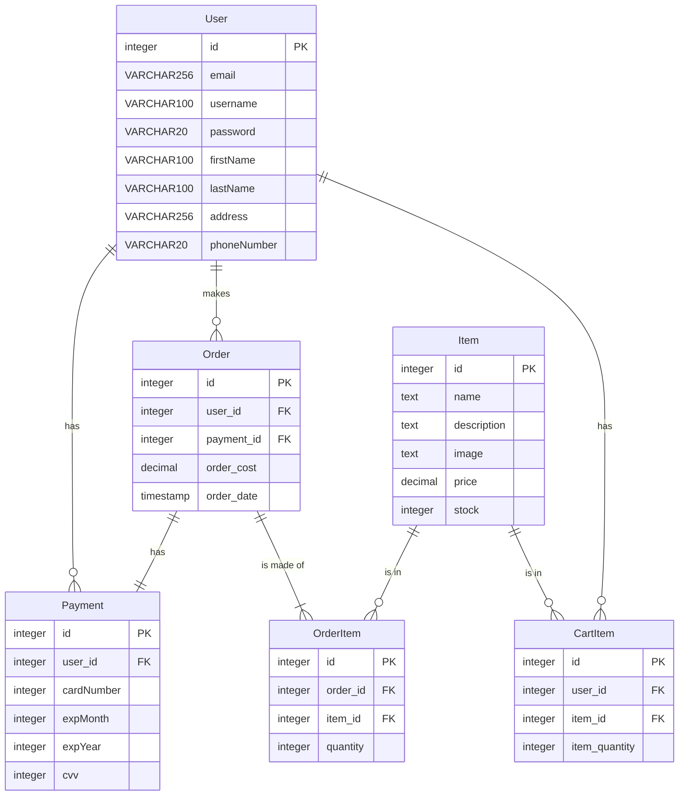

# Base de données

```mermaid
%%{init: { 'theme': 'default' } }%%

erDiagram
    User || -- }o Payment : "has"
    User || -- }o Order  : "makes"
    Order || -- || Payment : "has"
    Order || -- }| OrderItem : "is made of"
    Item || -- }o OrderItem : "is in"
    Item || -- }o CartItem : "is in"
    User || -- }o CartItem : "has"

    User {
        integer id PK
        VARCHAR256 email
        VARCHAR100 username
        VARCHAR20 password
        VARCHAR100 firstName
        VARCHAR100 lastName
        VARCHAR256 address
        VARCHAR20 phoneNumber
    }

    Payment {
        integer id PK
        integer user_id FK
        integer cardNumber
        integer expMonth
        integer expYear
        integer cvv
    }

    Item {
        integer id PK
        text name
        text description
        text image
        decimal price
        integer stock
    }

    CartItem {
        integer id PK
        integer user_id FK
        integer item_id FK
        integer item_quantity
    }

    Order {
        integer id PK
        integer user_id FK
        integer payment_id FK
        decimal order_cost
        timestamp order_date
    }

    OrderItem {
        integer id PK
        integer order_id FK
        integer item_id FK
        integer quantity
    }
```
